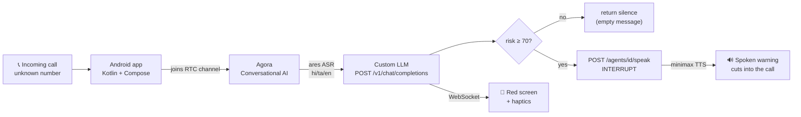

# VoiceShield

**A real-time scam-call guard for elderly people, built on Agora Conversational AI.**

VoiceShield listens to a live phone call, scores every turn for scam risk, and — when a
scammer is mid-sentence — cuts in with a spoken warning in the elder's own language.

> Built for the [AI Mobile Coders Voice AI Hackathon](https://aimobilecoders.com/hackathons/voice-ai-hackathon), 2026.

---

## The problem

Scam calls do not fail because the victim is gullible. They work because live social
engineering never lets the victim stop and think. The "digital arrest" script is explicit
about it:

> *"Aap call disconnect nahi karenge aur kisi ko batayenge nahi."*
> — You will not disconnect this call, and you will not tell anyone.

A blocklist cannot help here: the number is fresh, and the pressure is applied inside the
conversation. The intervention has to happen **during the call**, and it has to interrupt.

## What it does

1. An unknown number calls. Android's `CallScreeningService` arms the guard automatically —
   the elder does nothing.
2. Agora Conversational AI transcribes the call and sends every turn to VoiceShield's
   custom LLM endpoint, which scores scam risk 0–100.
3. Past a risk threshold of 70, the backend fires an out-of-band `speak` at the agent with
   `priority: INTERRUPT, interruptable: false`. The phone screen goes red, haptics fire, and
   a voice cuts into the call in Tamil, Hindi, or English.

## Results

Measured against a 59-case labelled corpus — 30 scams and **29 adversarial lookalikes**,
the lookalikes being the hard part.

| Metric | Result |
|---|---|
| Scams caught | **29 / 30** (recall 97%) |
| False alarms | **0 / 29** (FP rate 0%) |
| Precision | **100%** |
| Classify latency | p50 **1778 ms** · p95 2544 ms |

Reproduce it yourself: `cd backend && python -m eval.score_corpus`

**The zero matters more than the 97.** A false alarm that makes an elder hang up on their
real daughter is a genuine harm, not a rounding error — so the corpus is deliberately half
lookalikes: a real son asking for rent money, a genuine bank fraud team, a real police call,
a pharmacy refill, a delivery OTP. VoiceShield flags none of them.

The one remaining miss is a fake-charity solicitation scoring 15. It is left in the corpus
rather than tuned away, because lowering the threshold to catch it buys false alarms.

## Architecture



### How Agora Conversational AI is used

The pipeline is **ASR → LLM → TTS**, deliberately not `mllm`. Every Agora starter sample
pushes toward MLLM because it is lower latency for a chatbot — but `/speak`, the entire
warning mechanism, is unsupported under MLLM, and SAL recognition requires a custom LLM.

| Stage | Choice | Why |
|---|---|---|
| **ASR** | `ares` | Agora's own engine, the only vendor needing no third-party key. Covers hi-IN, ta-IN and eight more Indic languages. Sarvam and Microsoft are BYOK; sarvam additionally rejects an empty params block. |
| **LLM** | `custom` | Our FastAPI guard. Required for SAL `recognition` mode, and where risk scoring happens. `max_history: 16` — scam scripts escalate across turns. |
| **TTS** | `minimax`, managed | Only minimax and openai are available managed on this SKU; the rest answer *"vendor is not available for the current SKU"*. Minimax is natively multilingual, and the warning must be spoken in Hindi or Tamil to land. |
| **SAL** | `recognition` | Speaker identity per turn, so "give me the OTP" from the caller scores differently than from the elder. |

Every one of those was **probed against the live API, not chosen from documentation** — the
reasoning is preserved in comments in [`backend/app/agora.py`](backend/app/agora.py).

### Two design decisions that carry the project

**1. The guard returns silence.** `/v1/chat/completions` answers every turn with an empty
assistant message. A guard that chats is a guard the elder mutes. It speaks only when it has
something urgent to say — and warnings are debounced to one per 20s.

**2. The warning is out-of-band and uninterruptable.** Answering in-line would only be
spoken after the current turn ends, and a scammer's monologue may not end for a minute.
`INTERRUPT` cuts in mid-sentence; `interruptable: false` means the scammer talking over it
cannot suppress it. Breaking the no-time-to-think spell is the entire point.

### Failing closed

A safety device that fails silently is worse than none, because it manufactures the
confidence the scammer needs. An unreachable model, an expired key, or an empty balance used
to render as a green "you are protected" screen. Now every unjudgeable turn is labelled
`degraded` and surfaced, never scored as safe. The classifier sits on a free keyword rule
floor used as a **fallback, never a filter** — gating the model on a silent rule layer was
measured to cost 36 points of recall.

## Repo layout

```
app/                       Android client — Kotlin, Jetpack Compose, minSdk 26
  guard/                   RTC session, backend client, guard UI
  guard/call/              CallScreeningService auto-arm for unknown callers
backend/
  app/agora.py             Agora REST: tokens, agent lifecycle, the speak interrupt
  app/guard.py             The classifier — Gemini + rule floor, schema-constrained
  app/rules.py             Free keyword floor (fallback only)
  app/prompts.py           Classifier prompts
  data/scam_corpus.jsonl   59 labelled cases, 30 scam / 29 legit
  eval/score_corpus.py     Confusion matrix, latency, per-case detail
SETUP.md                   Agora account and credential setup
```

## Running it

Full credential walkthrough in [SETUP.md](SETUP.md).

```bash
# backend
cd backend
python3 -m venv .venv && .venv/bin/pip install -r requirements.txt
cp .env.example .env          # Agora keys + GEMINI_API_KEY
.venv/bin/uvicorn app.main:app --reload --port 8000
```

Agora's servers must reach your custom LLM endpoint, so localhost will not do:

```bash
ngrok http 8000 --url=https://your-domain.ngrok-free.dev
# put that URL in PUBLIC_BASE_URL, and in voiceshield.backend.url in local.properties
```

`GET /health` reports exactly what is missing — unset vars, bad Agora credentials, or
Conversational AI not enabled.

```bash
./gradlew :app:installDebug   # add :app:clean first if the tunnel URL changed
```

### Endpoints

| Endpoint | Caller | Purpose |
|---|---|---|
| `POST /session/start` | Android app | RTC token + starts the guard agent |
| `POST /session/{ch}/stop` | Android app | Stops agent, returns evidence transcript |
| `WS /ws/{ch}` | Android app | Live risk updates → red screen + haptics |
| `POST /v1/chat/completions` | **Agora** | The sensor. SSE required. |
| `GET /health` | you | Config and credential diagnostics |

## Known limitations

Stated plainly, because a safety product that oversells itself is the wrong kind of product.

- **Voiceprint enrollment is not built.** SAL `recognition` needs a downloadable sample of
  the elder's voice; without it, SAL locks onto whoever speaks first and clearest.
- **SAL metadata shape is beta.** `extract_turns()` probes the documented locations for
  `vpids` and degrades to `unknown` rather than crashing.
- **Single live session.** `_resolve_session()` falls back to the only live session; the
  channel is carried in the LLM callback URL to make concurrency work, but it is not
  load-tested.
- **The corpus is Indian scam patterns** in Hindi, Tamil and English. Other regions would
  need their own.

## Tech stack

Kotlin · Jetpack Compose · Agora RTC 4.6.3 · Agora Agent Toolkit 2.9.0 · OkHttp ·
FastAPI · Gemini 3.5 Flash Lite · Pydantic
